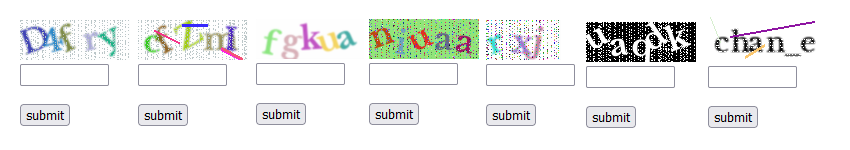

# Captcha for Laravel

_A Lightweight CAPTCHA Solution for Laravel_

**By** _HPD Code Solutions_


## Preview


## Table of Contents
- [What's New](#whats-new)
  - [Version 3.0.0](#version-300)
  - [Version 2.0.0](#version-200)
- [Installation](#installation)
- [Usage](#usage)
- [Configuration](#configuration)
  - [Properties](#properties)
- [How to use](#how-to-use)
  - [Session mode](#session-mode)
    - [Example](#example)
  - [API mode](#api-mode)
    - [Example](#example-1)
- [License](#license)   
- [Other Proiects](#check-out-my-other-projects) 

## What's New

### Version 3.0.0 

- **Added `word_puzzle` type configuration option**

    Now you can generate captcha challenges using incomplete English words from a dictionary. Users see a word with missing letters (e.g., ap_le) and must type the complete word (apple).
    ```php
    <div> {!!captcha_get_img('word_puzzle_default')!!}</div>
    ```
- **From now on, the `color` property in all types supports the `multi` option.**

- **⚠️ Updated Routes with `hpd` Prefix**

     All captcha routes have been updated to include a hpd prefix for better organization and avoiding naming conflicts with other CAPTCHA packages.
     - Web routes now use:
        ```arduino
        hpd/captcha/{config?}
        ```
     - API routes now use:
        ```php
        hpd/captcha/api/{config?}
        ```   

- **All published config files use the `hpd_` prefix to:**
    - **Avoid conflicts** with other CAPTCHA packages
    - **Unique identification** for HPD Captcha package
    - **Easy management** in projects with multiple packages

    | Package File |    Published As   |      Purpose     |
    |--------------|-------------------|------------------|
    | `config.php` | `hpd_captcha.php` | Main CAPTCHA settings & themes |
    
 - **All data files, such as the words file, will be placed in the address `storage\hpd\captcha\words_en.php` after publishing.**

- **Smart detection of published vs. package config and data files with seamless fallback.**

- **Refactored package directories structure** 

### version 2.0.0 

- **Added `math` type configuration option**  
  Now you can generate captcha challenges using simple math operations (e.g., `3 + 5 = ?`).  

- **Updated configuration options**  
  Existing configs have been optimized for better performance and easier customization.  

- **Refactored code structure**  
  The internal codebase has been restructured to improve security, readability, and maintainability.  

- **Bug fixes**  
  Several issues have been resolved to provide a smoother and more stable experience.  

- **Noise Options**

The `addNoise` method accepts two required arguments (`width` and `height`) and an optional associative array as the third argument to customize the noise effect.

### Parameters

| Option       | Type             | Default (if not provided)         | Description |
|--------------|------------------|-----------------------------------|-------------|
| **`xRange`** | `array[int,int]` | Determined automatically based on `difficulty` | Specifies the horizontal step size for applying noise. The first value is the minimum step, and the second is the maximum step. Smaller steps result in denser noise horizontally. |
| **`yRange`** | `array[int,int]` | Determined automatically based on `difficulty` | Specifies the vertical step size for applying noise. The first value is the minimum step, and the second is the maximum step. Smaller steps result in denser noise vertically. |
| **`mode`**   | `string`         | `'cross'`                        | Determines how the noise is applied: <br>• `'vertical'` → vertical lines of noise <br>• `'horizontal'` → horizontal lines of noise <br>• `'cross'` → both vertical and horizontal lines <br>• `'random'` → randomly scattered pixels |
| **`density`** | `float`         | `0.1`                             | Used only when `mode` is `'random'`. Defines the fraction of total image pixels that will contain noise. Must be between `0.0` and `1.0`. |
| **`intensity`** | `float`       | `1.0`                             | Multiplier for the color intensity of the noise. `1.0` means full brightness, `0.0` results in black. This can make the noise lighter or darker. |

---

### Example Usage

```php
// 1. Default noise based on difficulty
$this->addNoise(200, 100);

// 2. Only change mode
$this->addNoise(200, 100, ['mode' => 'cross']);

// 3. Override xRange and yRange manually
$this->addNoise(200, 100, [
    'xRange'   => [2, 6],
    'yRange'   => [3, 7],
    'mode'     => 'horizontal',
    'density'  => 0.4,//or $this->noiseDensity
    'intensity'=> 0.7 //or $this->noiseIndensity
]);
```
## Installation

Require this package with composer:
```
composer require hpd/captcha
```
⚠️It is recommended to install the latest version of this package.

## Usage

It doesn't need to add CaptchaServiceProvider to the providers array in config/app.php.


## Configuration

To use your own settings, first publish the config file:


```bash
php artisan vendor:publish --tag=hpd-captcha-config
```
Then customize configuration properties as you like.

```php
return [
    'disable' => env('CAPTCHA_DISABLE', env('APP_ENV') !== 'production'),
    'characters' => [
        'lowercase' => 'abdefghjklmnpqrstuvwxyz', 
        'uppercase' => 'ABCDEFGHJKLMNPQRSTUVWXYZ', 
        'digits' => '23456789' // 
    ],
    'default' => [
        'length' => 5,
        'bgColor' => '#FFFFFF',
        'color' => 'multi',
        'noiseLines' => true,
        'noise' => true,
        'noiseColor' => '#FFFFFF',
        'sensitive' => false,
        'digits' => true,
        'uppercase' => true,
        'lowercase' => true,
        'alpha' => 10,
        'blur' => true,
    ],
    ...
];
```
### Optional Words File Publishing (version >=3.0.)

The package comes with a built-in words file (resources/data/words_en.php) used for CAPTCHA generation, so it works immediately without any setup.

If you want to customize the words list, you can publish it to your application:

```bash
php artisan vendor:publish --tag=hpd-captcha-words
```

### Properties
The following properties are customizable from published config.php file.
```php
protected $config;
    protected string $bgColor = "#000000";//'random'
    protected string $color = "#FFFFFF";  //'random','multi'
    protected string $noiseColor = "#FFFFFF";//'random' 
    protected bool $blur = false;
    protected int $alpha = 0; // 0 -> 1
    protected bool $noise = false;
    protected string $noiseMode = 'cross';//'vertical','horizontal','cross','random'
    protected float $noiseDensity = 0.1; // 0 -> 1.0
    protected float $noiseIntensity = 1.0; // 0 -> 1.0
    protected bool $noiseLines = false;
    protected bool $difficulty = false;
    protected int $length = 5;
    protected int $expire = 60;
    protected bool $sensitive = false;
    protected array $characters;
    protected bool $lowercase = true;
    protected bool $uppercase = false;
    protected bool $digits = false;
    protected string $fontDir = '';
    protected string $font = 'libre.ttf';
    protected int $fontSize = 24;
    protected string $type = 'string';

```

## How to use

### Session mode
Session mode is designed for traditional web forms.
The captcha solution is stored in the server-side session and validated against the user’s input when the form is submitted

You can use the following helper functions in your project to get a Captcha image.
```php
    captcha(); // returns image
    
    captcha_get_src()// returns image source(URl)

    captcha_get_html()// returns img html element
```
Pass the configuration name to the function. If omitted, the 'default' configuration is
```php
    captcha('default'); // returns image
    
    captcha_get_src('easy')// returns image source(URl)

    captcha_get_img('dark')// returns img element
```
#### Example

Get Captcha image src:
```php
    
```
Get img element:
```php
    <div> {{!! captcha_get_img()!!}}</div>
```
Validation

```php

    Route::post('captcha_check', function() {
         $validator = Validator::make($request->all(), [
                'captcha' => 'required|captcha',
            ]);

            if ($validator->fails()) {
                return redirect()->back()
                    ->withErrors($validator)
                    ->withInput();
            }
   
 });
```
### API mode 

API mode is designed for single-page applications (SPA), mobile apps, or any frontend that communicates with the backend through JSON APIs.
Instead of sessions, the captcha state is temporarily stored in the cache. A captcha_token is returned and must be included in subsequent requests.
```php
     [
        'token'=>'816fc4e459eb3bd240a58beee41e723df2d1b1f29300f2a7920cdc372f728695' 
        ,
        'image'=>'data:image/png;base64,'.$this->createBase64FromImg($this->image)
     ]
```
#### Example
```js
        async function loadCaptcha(config='default') {
        try {
        const response = await fetch(`hpd/captcha/api/${config}`);
        const data = await response.json();
    
        const img = document.createElement("img");
        img.src = data.image; 
        document.getElementById("captcha-container").appendChild(img);
        document.getElementById('captcha_token').value = data.token;
    
    } catch (error) {
        console.error('CAPTCHA loading failed:', error);
    }
}

// Call the function
loadCaptcha('math');
```
Validation

```php
    $validator = validator()->make(request()->all(),
        ['captcha' => 'required|captcha_api:'. request('captcha_token')
       
        ];
    );
    if ($validator->fails()) {
        return response()->json([
            'captcha' => 'Invalid captcha',
        ],422);

    } else {
        // continue
    }
```
## License

This project is licensed under the [MIT License](./LICENSE).


## Check Out My Other Projects

Hey! If you liked this package, you might enjoy some of my other work too:

- [Validatify](https://github.com/hamid-hpd/validatify.git) – A PHP input validation library.

I'm always building and sharing new stuff — feel free to take a look, star ⭐ what you like, or even open a PR!
