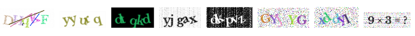

# Captcha for Laravel 


## Preview


- [Captcha for Laravel 8/9](#captcha-for-laravel-8-9)
  * [Preview](#preview)
  * [Installation](#installation)
  * [Usage](#usage)
  * [Configuration](#configuration)
    + [Properties:](#Properties)
  * [How to Use](#how-to-use)
    + [Desired Configuration ](#use-desired-configuration)
    + [Examples](#example)
  * [Validation](#validation)
     + [Session Mode: ](#session-mode)
     + [Stateless Mode:](#stateless-mode)
  
## Installation


Require this package with composer:
```
composer require hpd/captcha
```
## Usage

It doesn't need to add CaptchaServiceProvider to the providers array in config/app.php.


## Configuration

To use your own settings, first publish config/config.php.
Then customize configuration properties as you like.

```$ php artisan vendor:publish config/config.php```
```php
return [
    'disable' => env('CAPTCHA_DISABLE', !str_contains(env('APP_ENV', 'local'), 'prod')),
    'characters'=>[
        'lowercase'=>'abxefghijklymcnopsqrtuvd',
        'uppercase'=>'AXOBEPFCYDGWSJKZHIRULMNQTV',
        'digits'=>'6302581497'
    ],
    'default' => [
        'length' => 5,
        'bgColor'=>'#FFFFFF',
        'color'=>'random',
        'flake'=>true,
        'flakeColor'=>'#BBC6C8',
        'sensitive'=>false,
        'digits'=>true,
        'uppercase'=>true,
        'lowercase'=>true,
        'alpha'=>10,
        'blur'=>true
    ],
    ...
];
```
### Properties
The following properties are customizable from published config.php file.
```php
    protected string $bgColor="#000000";
    protected string $color="#FFFFFF";
    protected string $flakeColor="#FFFFFF";
    protected bool $blur=false;
    protected int $alpha=0;
    protected bool $flake=false;
    protected bool $line=false;
    protected bool $difficult= false;
    protected int $length=5;
    protected int $width=110;
    protected int $height=40;
    protected int $expire=60;
    protected bool $sensitive=false;
    protected array $characters;
    protected bool $lowercase=true;
    protected bool $uppercase=false;
    protected bool $digits=false;
    protected string $fontDir='';
    protected string $font='libre.ttf';
    protected int $fontSize=24;
```

## How to use
You can use following helper functions in your project to get Captcha image.
```php
    captcha(); // returns image
    
    captcha_get_src()// returns image source(URl)

    captcha_get_html()// returns img html element
```
### Use desired configuration
```php
//If omitted configuration optional parameter, 'default' configuration will be used.

    captcha('default'); // returns image
    
    captcha_get_src('easy')// returns image source(URl)

    captcha_get_html('dark')// returns img html element
```
### Example

Get Captcha image src:
```html
    
```
Get img html element:
```html
    <div>
        {{!! captcha_get_html()!!}}
    </div>
```

## Validation
### Session Mode:
```php

    Route::post('captcha_check', function() {
            $validator = validator()->make(request()->all(), 
                ['captcha' => 'required|captcha'];
            );
            if ($validator->fails()) {
                echo '<p style="color: #ff0000;">Incorrect!</p>';
            } else {
                echo '<p style="color: #00ff00;">Matched </p>';
            }
   
    });
```
### Stateless Mode:
You can get image and code from this url:
`http://localhost/captcha/api/default`
It returns:
```php
     [
        'code'=>$hash,
         'sensitive'=>$this->sensitive,
          'image'=>'data:image/png;base64,'.$this->createBase64FromImg($this->image)
          ]
```

Then to validate captcha, you should send 'code' to the validator.

Set config type same as the type that you previously selected.
```php
    $validator = validator()->make(request()->all(),
        ['captcha' => 'required|captcha_api:'. request('code') . ',default'];
    );
    if ($validator->fails()) {
        return response()->json([
            'message' => 'invalid captcha',
        ]);

    } else {
        // continue
    }
```

        
 
